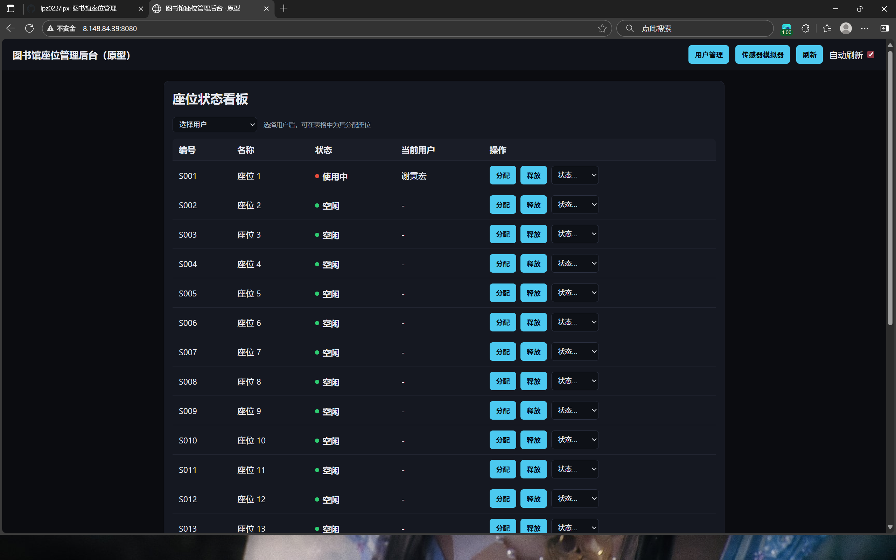
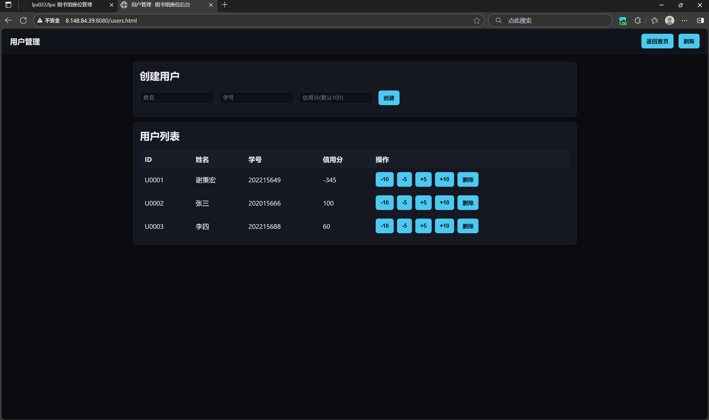
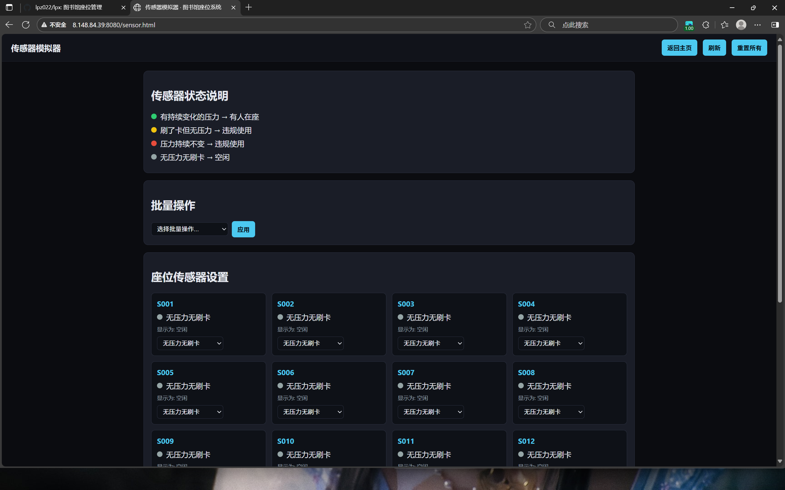
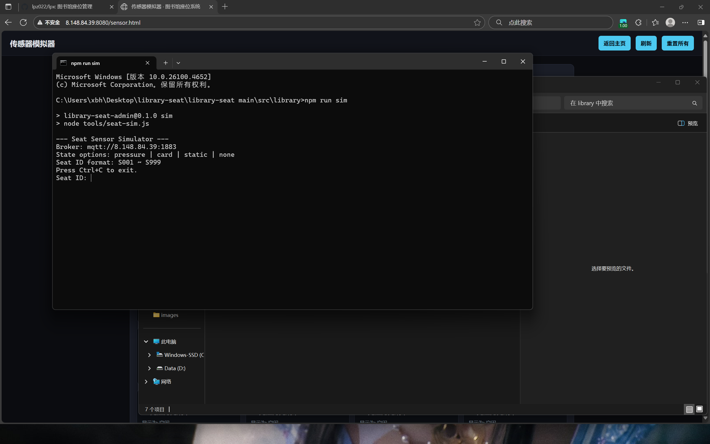

## 图书馆座位管理系统
点击[这里](http://8.148.84.39:8080/)可以访问图书馆座位管理系统。

## 快速原型截图
### 主页
点进链接后进入的是管理系统的主页，可以看见各个座位的状态

### 用户管理界面
右上角有用户管理界面，可以创建并删除用户，用来模拟图书馆用户的凭卡（一般是校园卡）注册，并给予初始信用分

### 网页内传感器模拟
因为程序上目前无法实现与压力传感器结合来监测座位状态，所以设计了一个网页传感器模拟来设置各个座位状态

### 终端传感模拟
因为网页传感模拟无法更真实的表现出终端与云端之间的联动，它始终是在云端上模拟完成，所以我设计了一个终端模拟，在终端上设置座位状态，并期望通过mqtt协议将信息上传云端服务器，从而改变座位的显示状态来提醒管理员
