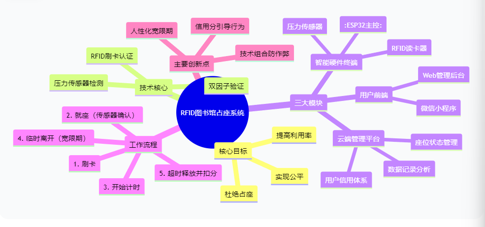

# 软件工程定项第一次会议记录

 * **参会者**：谢秉宏
 * **时间**： 2025 年 9 月 23 日周二 南一楼机房 804

## 项目选择
基于RFID技术和压力传感的图书馆座位管理系统

## 主要技术栈
前端：JavaScript,HTML,CSS 
后端：Node.js,Express框架，mqtt等等

## 团队分工：
都由谢秉宏完成

## 项目分析（头脑风暴）

### 1.现在大学图书馆急需改变的现状
在大学图书馆中，座位作为一种宝贵的公共资源，长期存在严重的“占座”问题。学生常用书本、水杯等个人物品长时间占用座位，而人却长时间离开，导致座位实际利用率极低。尤其在考试周等高峰期，这种“一座难求”与“虚位以待”的矛盾异常尖锐，不仅造成了资源浪费，也引发了学生间的纠纷，破坏了图书馆应有的公平、有序的学习氛围。学生们迫切需要一个能够公平分配座位、实时释放闲置资源、有效杜绝占座行为的智能化管理方案。

### 2. 改进方式

* 技术融合创新：我设计并实现一套基于RFID技术与物联网传感器的智能管理系统。在每个座位部署集成RFID读卡器（用于识别学生校园卡身份）和压力传感器（用于监测真实就座状态）的终端设备（模拟）。

* 双因子认证与智能判定：系统通过“身份认证”与“状态感知”相结合的双因子认证机制，智能区分“真人就座”与“物品占座”，并设定合理的临时离开宽限期，避免“一刀切”管理。

* 动态信用管理体系：建立一套以信用分为核心的激励与约束机制。对占座、超时等违规行为自动扣分，信用分与使用权限挂钩，引导用户形成规范使用的习惯。

* 全平台可视化管理：为图书馆管理员提供Web管理后台，实时监控全馆座位状态、管理用户信用、生成数据报表。

* 可持续运营机制：系统采用模块化设计，具备高可扩展性，未来可便捷地扩展预约功能、人脸识别等新特性，确保持续满足图书馆发展需求。

### 3. 题目来源

* 大学以来经常去图书馆受到不少此该问题的困扰，从而得出这样的想法

### 4. 需求

* 座位管理

* 用户管理

* 传感器模拟功能

* 终端云端联动功能

## 思维导图

## 会议图片

