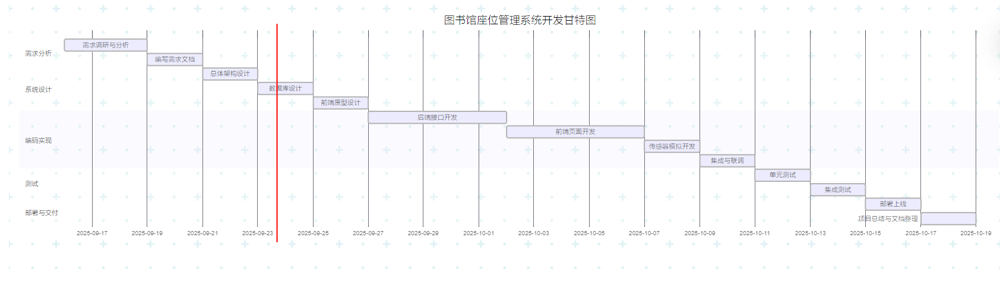

# 进度计划

## 设计

- 立项、NABCD
- 原型系统
- 需求分析
- 进度计划

## 开发

**任务分解：**

### 前端

谢秉宏

#### 界面布局

谢秉宏

- 主页座位管理页面
- 用户管理页面
- 传感器模拟页面

#### 界面交互

谢秉宏

- 座位管理/分配/状态强制设置 操作提示
- 创建/删除用户 & 用户管理页面跳转
- 增加/减少信用分操作
- 页面传感器模拟交互

#### 功能设计

谢秉宏

### 后端

谢秉宏

#### 数据库

谢秉宏

- 记录信息表
- 座位信息表
- 传感器信息表
- 用户信息表	

## 测试
谢秉宏

#### 单元测试

- 前端单元测试
- 后端单元测试

#### 集成测试

- 云端服务器部署

- 前端组件集成测试

# 甘特图

[甘特图网址](https://www.mermaidchart.com/app/projects/95114db6-e60a-4fe6-8ec4-96836132768a/diagrams/d50dba80-53a9-46c6-82d2-b98721615f7e/version/v0.1/edit)

