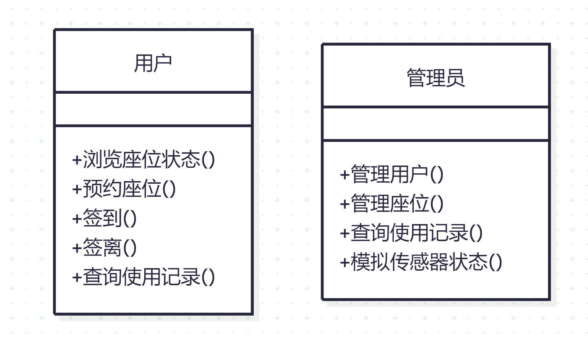
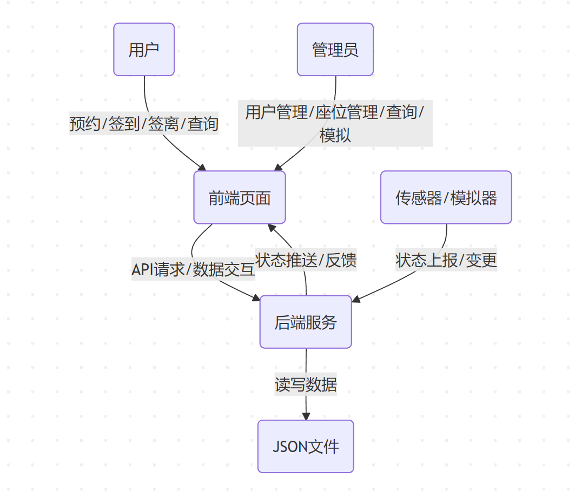
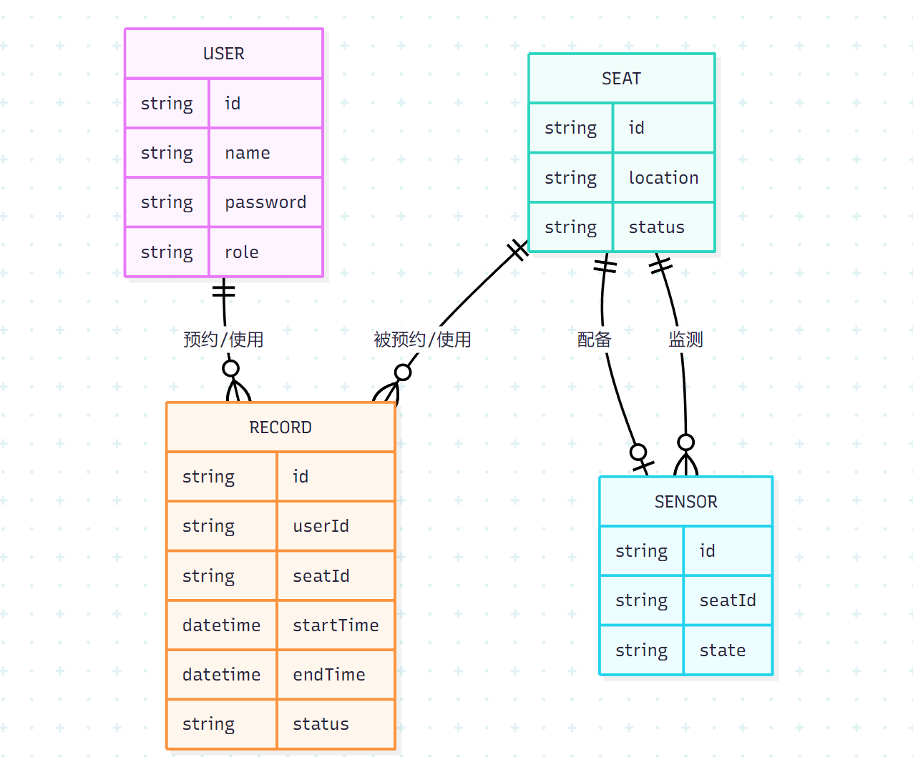
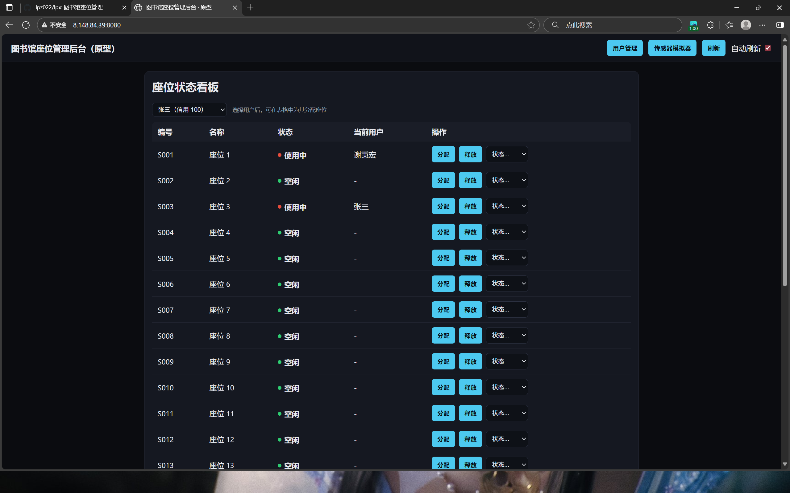
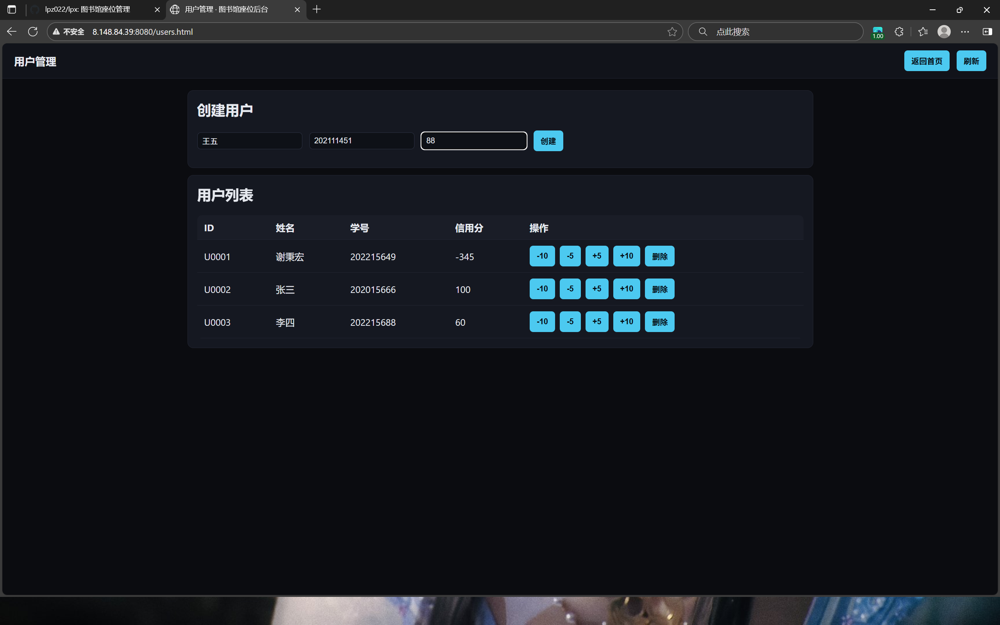
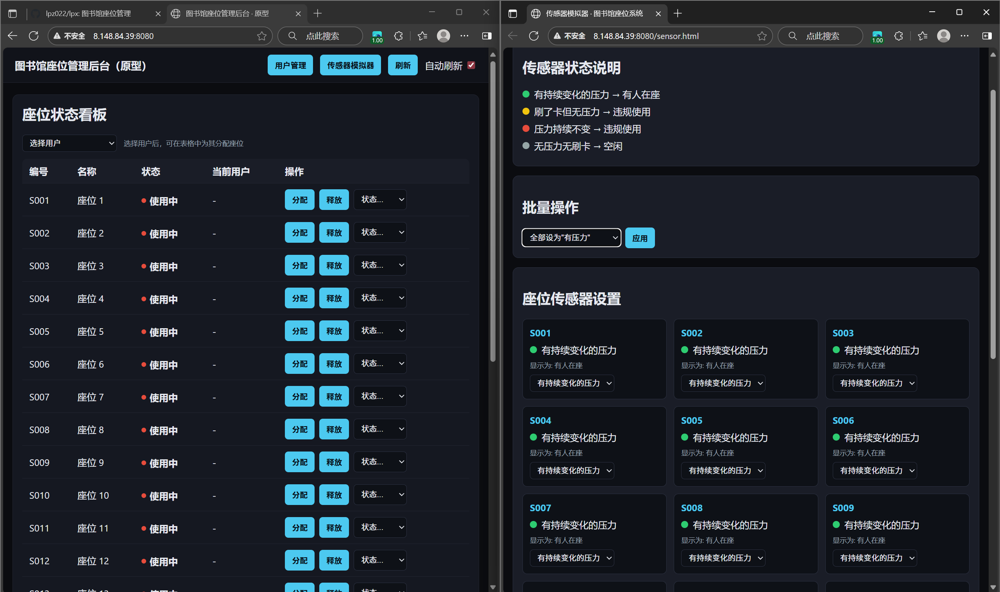
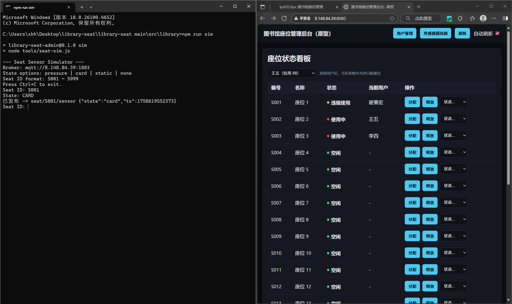
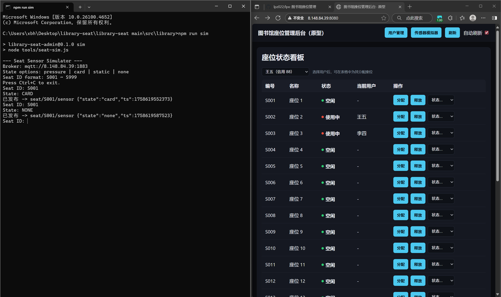
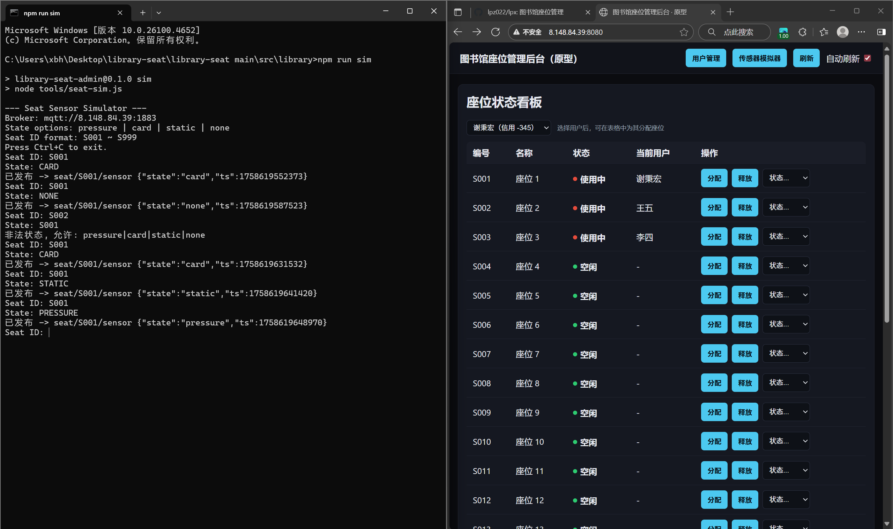

# 产品描述

本产品为一款面向高校及公共图书馆的智能座位管理系统，旨在提升图书馆座位资源的利用效率，优化用户体验，实现座位预约、使用、管理的智能化、信息化。系统集成了前端网页、后端服务、数据存储与传感器模拟等模块，支持用户在线选座、实时查看座位状态、自动签到签离、违规占座检测等功能。管理员可通过系统便捷地管理用户、座位和使用记录，提升管理效率。

本系统采用轻量级架构，数据以 JSON 文件存储，便于部署和维护。前端界面简洁友好，支持多终端访问。通过传感器数据模拟，实现对座位实际使用情况的自动感知，减少人工巡查压力。系统适用于各类需要座位预约与管理的场景，具有良好的扩展性和实用性。

# 产品功能

* 数据存储与管理

初始化和确保数据文件存在
读写 JSON 数据（如座位、用户、记录等）

* MQTT 桥接

启动 MQTT 桥接服务，实现与传感器等外部系统的数据通信

* 传感器模拟

提供命令行交互，模拟座位传感器数据

* 前端主页面功能

显示座位状态
加载和渲染用户、座位信息
处理用户点击、状态变更
自动刷新页面数据

* 传感器管理页面

加载传感器信息
渲染传感器控制面板
更新、重置传感器状态
批量操作传感器

* 用户管理页面

加载用户信息
渲染用户列表
创建用户、处理用户操作

# 系统用例

系统中最重要的两个角色是用户和管理员，其功能的用例图如下：

# 系统数据流图

系统运行数据流图如下：

# 系统ER图

有上述描述可以得到系统的ER图如下：

# 系统功能描述

本系统实现了基于Web的座位预约、用户与座位管理、传感器模拟、数据存储与实时状态展示等核心功能，支持用户与管理员多角色操作，提升图书馆座位管理的智能化与便捷性。

## 主页座位状态管理界面
这里可以直观看到图书馆每个座位的使用情况以及使用者，也可以实时检测座位使用状态，检测是否违规使用。分配和释放用来演示刷卡入座以及刷卡退座。

## 用户管理界面
这里可以按照学生姓名和学号创建用户，在实际应用上是凭校园卡进行注册，并赋予一定的信用分，且可以进行加减信用分操作，到实际应用上会依据信用分会执行一定的奖惩制度。

## 传感器模拟以及座位状态设置界面
在这里可以设置座位状态，可以单独设置也可以一键设置所有座位的状态，方便管理员对座位进行维护或其他操作。

## 终端压力传感模拟界面
因为目前无法实际结合压力传感器，所以我设计了一个终端用来模拟压力传感，可以选择一个座位的id，并赋予状态并通过mqtt桥接使其状态发送到云端服务器并显示在页面上，其中PRESSURE对应“检测到正常人体压力”的状况，是正常使用座位，会显示“使用中”；CARD以及STATIC分别代表“刷了卡但无人在座”以及“检测到静态压力超过一段时间”的状况，这些状况代表了违规占座，是“违规使用”；NONE代表着无人在座也无人刷卡，会显示“空闲中”。
传感器终端可以在library文件中的地址栏输入cmd打开命令行输入npm run sim指令来打开。

